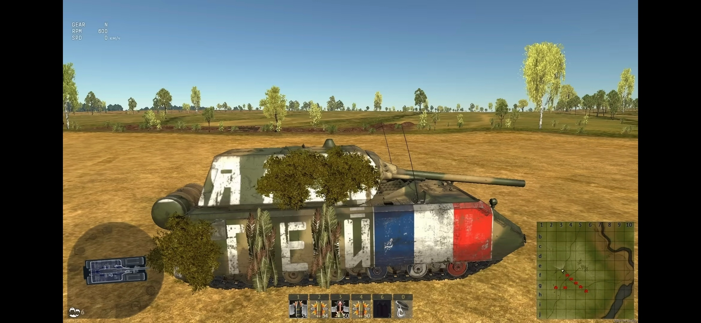

# Инструкция для работы с MD

## Выделение текста

Чтобы выделеить текст курсивом необходимо обрамить его звездочками (*) или знаком нижнего подчеркивания (_). Например *вот так* или _вот так_

Чтобы выделить текст полужирным, необходимо обрамить его двойными звездочками или двойным нижним подчеркиванием (**). Например **вот так** или __вот так__

Альтернативные способы выделения нужнны чтобы совмещать эти способы. Например: _текст может быть выделенен курсивом и при этом быть **полужирным**_.

## Списки
Чтобы выделить ненумерованный список, использовать (*)

## Работа с изображениями

Чтобы вставить изображение в текст достаточного написать следующее:

## Ссылки

## Работа с таблицами

## Цитаты

## Заключения